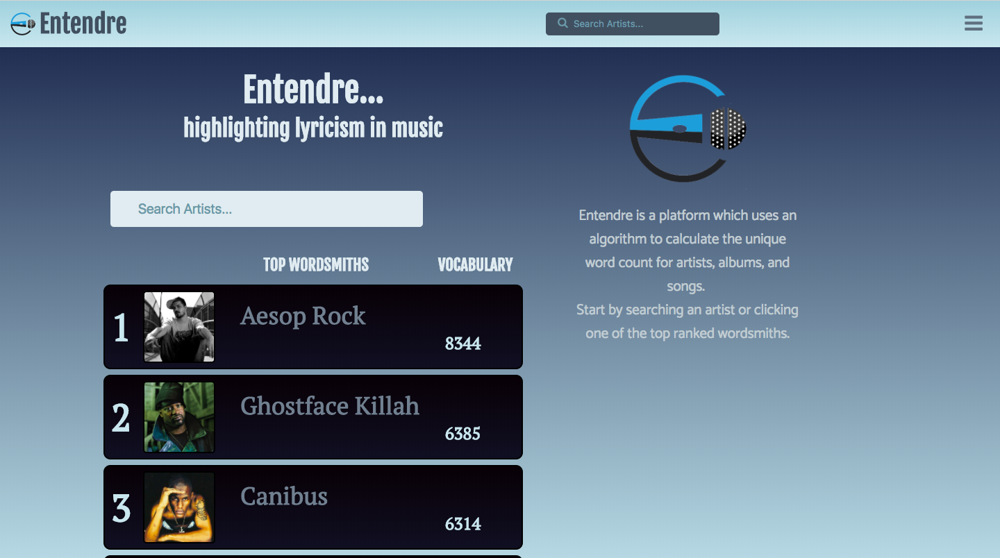
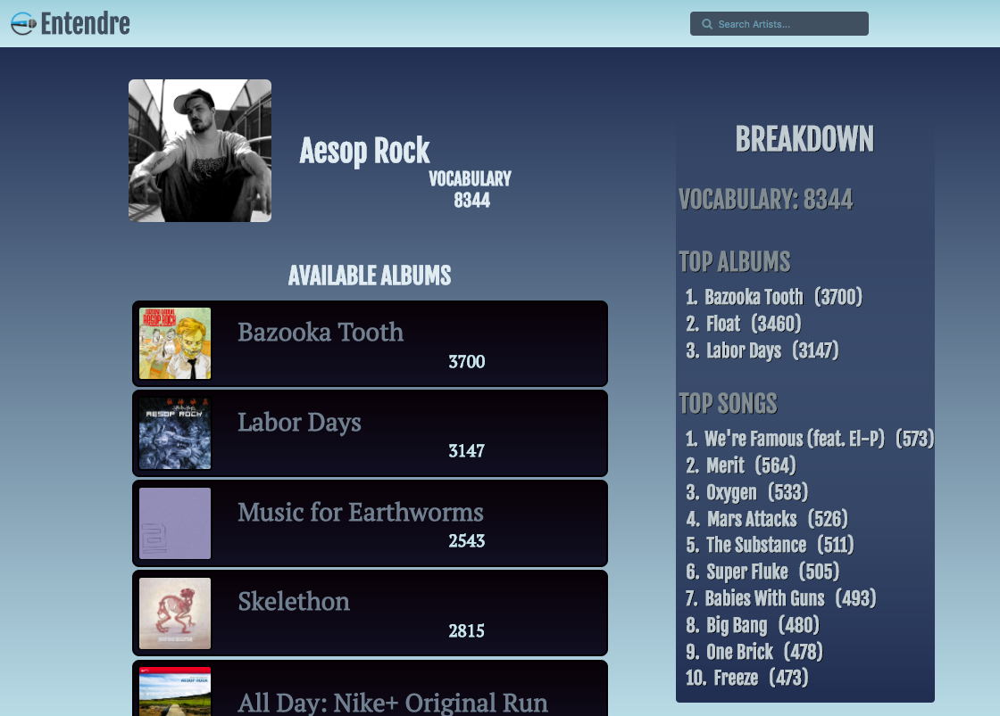
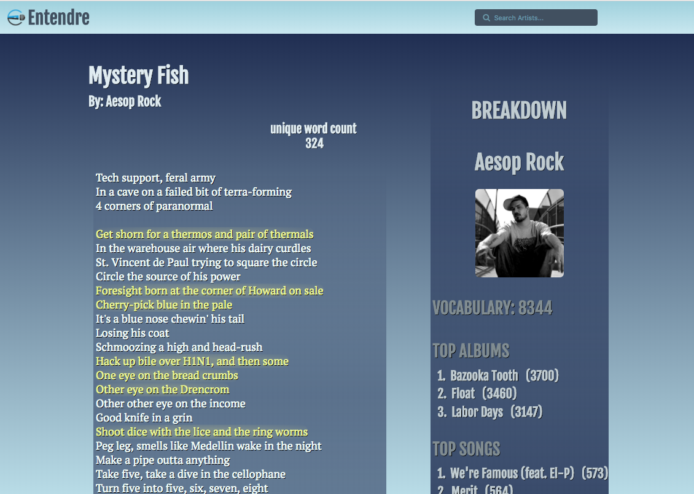

# Entendre

Entendre is a web platform which calculates unique word count and literary devices in music lyrics. Time to highlight amazing lyricism in music.

## Deployed sites

[entendre.live](https://entendre.live)

## Screenshots
Homepage

Artist page

Lyrics page

Mobile

## Walkthrough

[Click here to watch](https://youtu.be/hVFdqWmppgo)

### To run locally

1. Fork and clone the repo
1. In command line, git clone {insert-your-repo-SSH-key}
1. Run npm install
1. In order to view on your local host, run npm start
